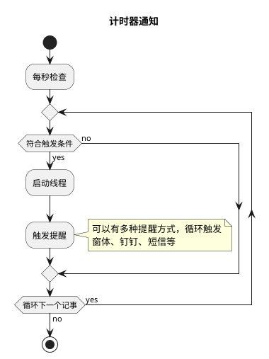
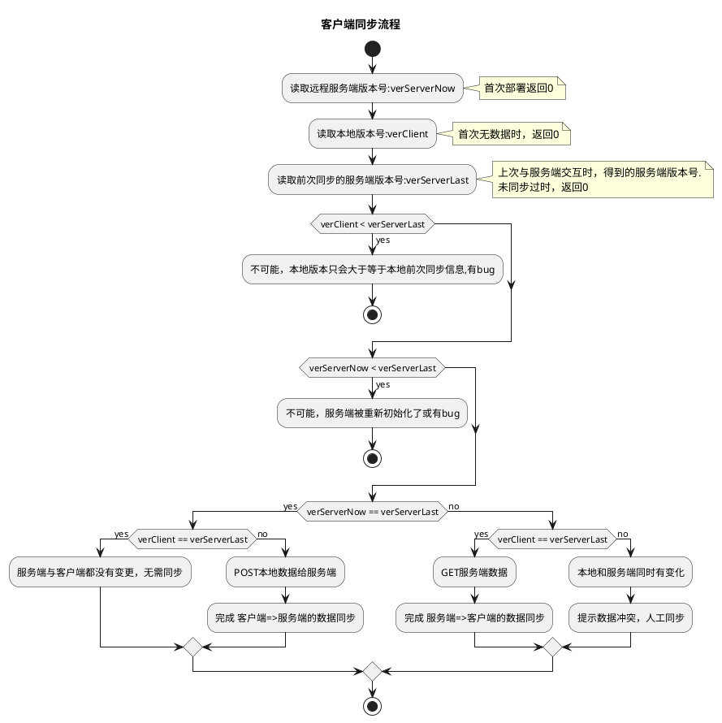
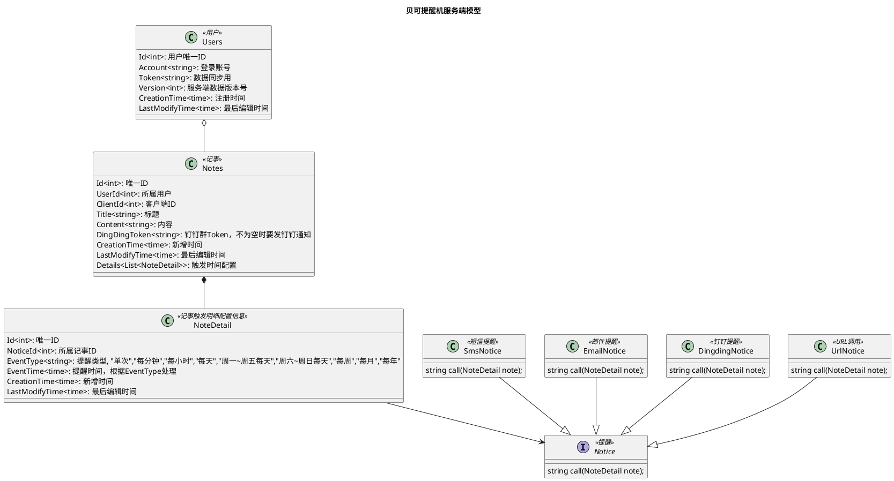

# 贝可提醒机

## 需求

个人的一些事件记录，并允许定时提醒或做一些处理，常见场景：

- 生日提醒，每年都要提醒，并可提前5天、3天、1天各提醒一次；
- 临时事件，如10天后去医院复查，只提醒一次；

提醒方案：

- 短信、邮件、钉钉群通知等；
- 时间到，自动调用某个URL。

其它：

- SaaS机制，事件按用户ID隔离；
- 事件可以通知多人，或调用多个URLL。

### 原型地址

产品的原型链接

### 系统上下文图

_【编写说明】用于描述待建系统与所在环境之间的关系，它定义了待建系统与系统外部之间的边界和接口_

### 用例图

_【编写说明】用例图应该区别于功能清单，主要体现出Actor对系统的交互。通过用例图可以帮助设计人员理解及整理需求，建议用例图可以从原型中提取，并使用功能清单进行核对。_

### 关键流程

### 其他需求

_【编写说明】来自产品负责人和高级设计人员的非功能性需求_

## 概要设计

### 关键架构决策

### 领域模型或类图

## 详细设计

### 接口

### 事件

_【编写说明】描述对外公开的事件的详细信息_

### 可复用组件（UI）清单

_【编写说明】按端描述对外公开的可复用界面或组件的清单信息_

## 专项设计

_【编写说明】针对重要或负责的业务进行更细粒度的设计，一般采用状态图、时序图、活动图、数据流图等体现较为复杂的业务场景_

## 技术债务

_【编写说明】由于时间、排期等因素，每个版本的设计或开发都会包含若干含有减法的架构决策，因此需要对该类的决策中未解决的业务及技术问题进行记录，便于下一步进行技术债务的解决_
